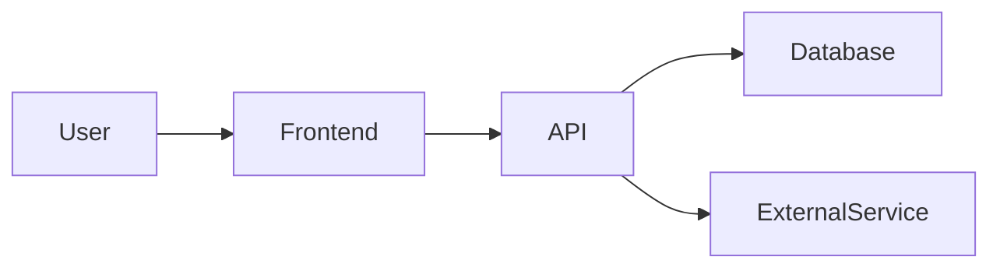

# Architecture

How {{PROJECT_NAME}} works — system structure, data model, key patterns, and the design decisions behind them. This is a living document: update it when the architecture changes, and link architectural decisions to [DECISIONS.md](DECISIONS.md) for their rationale.

> **OKF conformance.** This document follows the [Open Knowledge Format v0.2](https://github.com/GoogleCloudPlatform/knowledge-catalog/blob/main/okf/SPEC.md) convention. Architectural decisions recorded here should link to their canonical record in DECISIONS.md.

---

## System overview

<!-- PROJECT: Describe the high-level system. What are the major components? How do they communicate? -->

*Replace this with your system overview. A good starting point:*
- *What are the main services/components?*
- *What's the request flow (user → frontend → API → database)?*
- *What external services do you depend on?*

<!-- Example diagram (Mermaid renders in GitHub):

-->

## Data model

<!-- PROJECT: Describe the core data entities and their relationships. What databases/tables exist? -->

*Replace this with your data model description. Cover:*
- *Core entities and their relationships*
- *Multi-tenancy model (if applicable)*
- *Key constraints and invariants*

## Key patterns

<!-- PROJECT: What architectural patterns does the system use? -->

*Replace this with your key patterns. Examples:*
- *Multi-tenant via org-scoping*
- *Event-driven communication*
- *Repository pattern for data access*
- *Capability-based authorization*

## Cross-cutting concerns

<!-- PROJECT: Auth, security, observability, error handling, etc. -->

*Replace this with your cross-cutting concerns:*
- *Authentication & authorization model*
- *Security boundaries (e.g., row-level security)*
- *Observability (logging, metrics, tracing)*
- *Error handling strategy*

## Architectural decisions

Key architectural decisions and their rationale. Each should link to its canonical record in [DECISIONS.md](DECISIONS.md):

<!-- Example:
- **Multi-tenant via org-scoping** — see [DEC-001](DECISIONS.md#DEC-001)
- **RLS as the authority** — see [DEC-003](DECISIONS.md#DEC-003)
-->

## How to update this document

- When you add a new component or service, document it in **System overview**.
- When you make an architectural decision, record it in DECISIONS.md (`/decisions add`) and link it from the relevant section above.
- When you change the data model, update **Data model**.
- Run `vef validate --strict` to check schemas and cross-links.
- Use `vef show`, `vef refs`, `vef why`, `vef graph`, and `vef search` to inspect canonical project state without an agent.
